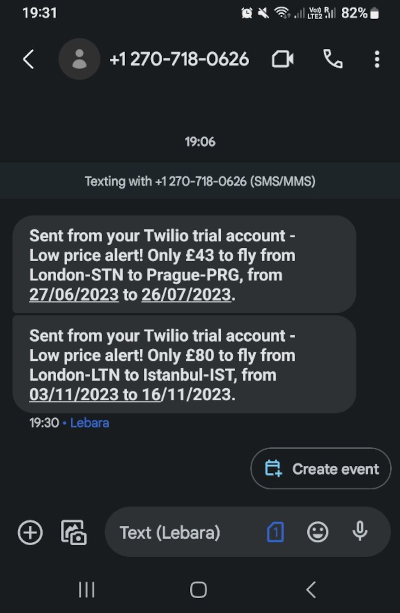

## Flights Deal Finder

Program written in Python and requestes APIs      

Take destinations and your budget price from [Google Sheet](https://docs.google.com/spreadsheets/d/1JLzSFlrqfka_8t1aQa0lB5ghG4MnUPgeUA6jOtapp-Y/edit#gid=0) with [Sheety API](https://sheety.co/) and return a SMS alert using [twilio API](https://www.twilio.com/en-us). The flights will reaserch in [Tequila API](https://tequila.kiwi.com/portal/login)


**Search lowest prices of flights with us!**


###### It's a part of the **#100DaysOfCode** challenge by Angela Yu. ######


#### Prerequisites
You will need the following software to run the Flights Deal Finder:
 - [Python 3](https://www.python.org/downloads/)
 - [python-dotenv](https://pypi.org/project/python-dotenv/)

You will need the following API's account to run the Flights Deal Finder:
 - [Sheety API](https://sheety.co/)       
 - [Tequila API](https://tequila.kiwi.com/portal/login)
 - [twilio API](https://www.twilio.com/en-us)

#### Installation
To get started with the Flights Deal, follow these steps:

1. **Install** python-dotenv:

```sh
pip install python-dotenv
```

2. **Clone** the repository:

```sh
git clone https://github.com/resole79/flights_deal.git
```

3. **Run** the **main.py** file:

```sh
python3 main.py
```     

#### *File Structure*
 - **main.py**: Main program.       
 - **data_manager.py** : Class "DataManager"        
	 - *Instance*: sheety_json       
	- *Method*: get_sheet, update_sheet       
 - **flight_search.py** : Class "FlightSearch"       
 	- *Method*: get_code_city, search_fly       
 - **flight_data** : Class "FlightData"
 	 - *Instance*: price, origin_city, origin_airport, destination_city, destination_airport, out_date, return_date        
 - **notification_manager.py** : Class "NotificationManager"        
	 - *Instance*: client        
	 - *Method*: send_text       

#### **Usage**

<p align="center"><br><i></i></p>

## **Credit**

Author : Emilio Reforgiato (resole79)

##
<p align="right"><a href="https://www.linkedin.com/in/emilio-reforgiato/" target=”_blank” ></a></p>


